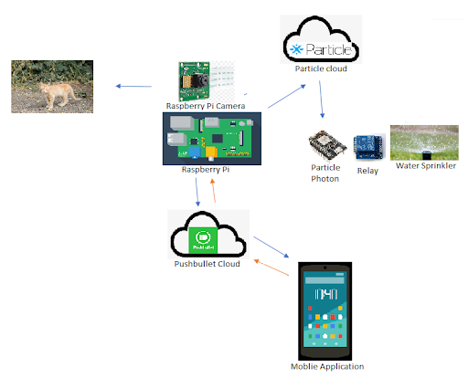
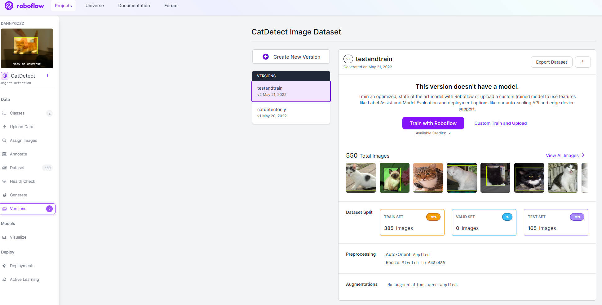
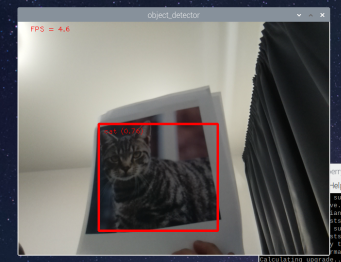

# Animal Deterrence System

This project implements a real-time animal deterrence system using a Raspberry Pi 4b to run the EfficientDet0 object detection TensorFlow Lite Model. The model was transformed with an additional dataset of cats from kaggle to improve the model's accuracy at identifying cats.

  

Dataset used: DatasetAsirra: Cats vs Dogs Object Detection Dataset  
Roboflow was used to resize the images to 640x480 pixels to match the COCO 2017 dataset image resolution. Dataset also reduced from 1100 to 550.  

  

Model Test

  

Wiring to turn on an external LED on a particle photon. Resistor used: 330Ohms.

